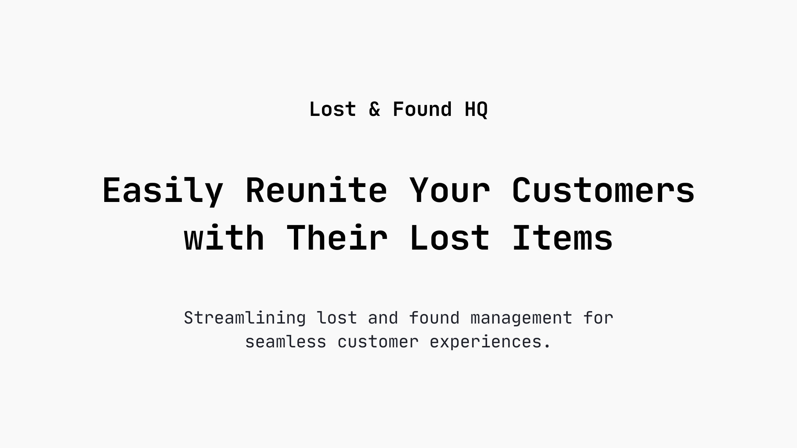

<strong>Lost & Found HQ</strong>

Easily reunite your customers with their lost items. A platform to streamline lost and found management with ease.

 

<a href="https://www.lostandfoundhq.com">Website</a> 
 · 
<a href="https://github.com/internetdrew/lost-and-found-hq">GitHub</a> 

## Introduction

Lost & Found HQ is a platform that helps businesses streamline their lost and found operations, making reuniting customers with their missing items effortless.

## Why

After losing my wallet, I thought it might be great if the process was a little more transparent. It would be great if instead of hoping staff saved a phone number and passed it on to other coworkers, perpetually keeping an eye out for a lost item, that I could visit a business' lost and found page and see if my item popped up at some point.

## Roadmap

- Log into your dashboard to manage lost and found items at your place of business. [#12](https://github.com/internetdrew/lost-and-found-hq/pull/12)
- Add your business location to your dashboard. [#15](https://github.com/internetdrew/lost-and-found-hq/pull/15)
- Users should be able to toggle public viewability on items, as well as edit and delete them. [#21](https://github.com/internetdrew/lost-and-found-hq/pull/21)
- Add testing to the frontend code. [#22](https://github.com/internetdrew/lost-and-found-hq/pull/22)
- Visitors can sign up to get launch updates. [#23](https://github.com/internetdrew/lost-and-found-hq/pull/23)
- Make test account available for visitors to play with and clear test user items. [#23](https://github.com/internetdrew/lost-and-found-hq/pull/23), [#24](https://github.com/internetdrew/lost-and-found-hq/pull/24)
- Allow users to create a public portal for customers to view items. [#25](https://github.com/internetdrew/lost-and-found-hq/pull/25)
- Limit input lengths on dashboard. [#26](https://github.com/internetdrew/lost-and-found-hq/pull/26)
- Add tests for the dashboard. [#28](https://github.com/internetdrew/lost-and-found-hq/pull/28)
- Add important staff details to items. [#29](https://github.com/internetdrew/lost-and-found-hq/pull/29)
- Make navigation sticky [#30](https://github.com/internetdrew/lost-and-found-hq/pull/30)
- Add input validation to API layer [#31](https://github.com/internetdrew/lost-and-found-hq/pull/31)
- Integrate Stripe checkout for subscription [#32](https://github.com/internetdrew/lost-and-found-hq/pull/32)
- Allow users (admin) to add a custom page slug once they're subscribed.
- Allow users (admin) to include a company logo for the public page view.
- Allow users (searchers) to open claims on the items publicly viewable with a "This is mine" button.

<!-- Claims -->

- Basic claim flow:

  - User sees item → submits claim with email + details
  - Business reviews claim details
  - If approved → User gets pickup code via email
  - If denied → User gets notification with reason
  - Business marks item as returned using pickup code

- If more info is needed:

  - Business clicks "Request More Info" + adds specific questions
  - User gets email with link to respond
  - Send email with link:
    /claims/{claim_id}/conversation/{conversation_id}?token=<token>
  - User clicks email link
  - Token validates their access
  - Shows simple form with:
    - Original claim details
    - Business questions
    - Text area for response
  - Submit → Updates claim status back to "pending"
